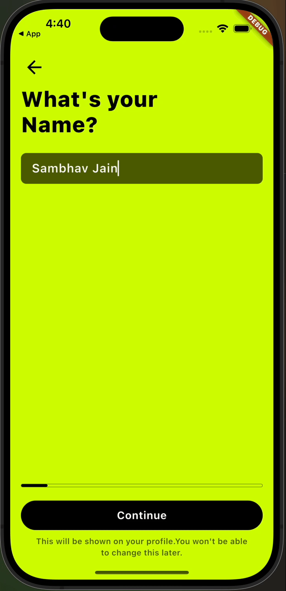

# Bouncy Effect

A Flutter package that adds a delightful bouncy scale animation effect to any widget when tapped. This provides tactile feedback for user interactions.

## Demo

| Example 1                           | Example 2                           |
| ----------------------------------- | ----------------------------------- |
|  |  |

## Features

- 🎯 Smooth bouncy scale animation on tap
- ⚙️ Customizable scale factor
- 🔄 Enable/disable scaling animation
- 🎮 Optional tap callback
- 🎨 Works with any widget
- 🚀 Lightweight and easy to use
- ✨ No external dependencies

## Getting Started

Add this to your package's `pubspec.yaml` file:

```yaml
dependencies:
  bouncy_effect: ^1.0.0
```

Install the package by running:

```bash
flutter pub get
```

## Usage

Import the package:

```dart
import 'package:bouncy_effect/bouncy_effect.dart';
```

Basic usage:

```dart
BouncyEffect(
  onTap: () {
    print('Widget tapped!');
  },
  child: Container(
    width: 100,
    height: 100,
    color: Colors.blue,
  ),
)
```

### Examples

1. Basic Button with Bouncy Effect:

```dart
BouncyEffect(
  onTap: () => print('Button pressed!'),
  child: ElevatedButton(
    onPressed: () {},
    child: Text('Tap Me'),
  ),
)
```

2. Custom Scale Factor:

```dart
BouncyEffect(
  lowerBound: 0.8, // Scales down to 80% when pressed
  onTap: () => print('Image tapped!'),
  child: Image.asset('assets/my_image.png'),
)
```

3. Disable Animation Conditionally:

```dart
BouncyEffect(
  isScalingEnabled: isAnimationEnabled, // Control animation with a boolean
  onTap: () => print('Card tapped!'),
  child: Card(
    child: ListTile(
      title: Text('Tap me!'),
    ),
  ),
)
```

## Parameters

| Parameter          | Type            | Default  | Description                                           |
| ------------------ | --------------- | -------- | ----------------------------------------------------- |
| `child`            | `Widget`        | Required | The widget to apply the bouncy effect to              |
| `onTap`            | `VoidCallback?` | null     | Callback function called when the widget is tapped    |
| `isScalingEnabled` | `bool`          | true     | Enable or disable the scaling animation               |
| `lowerBound`       | `double`        | 0.9      | The scale factor when pressed (must be less than 1.0) |

## Contributing

Feel free to contribute to this package by creating issues or submitting pull requests on our [GitHub repository](https://github.com/yourusername/bouncy_effect).

## License

This project is licensed under the MIT License - see the [LICENSE](LICENSE) file for details.
